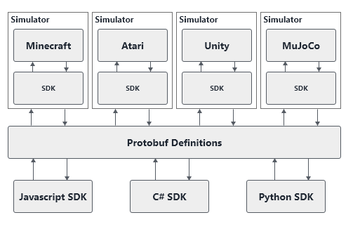

# Roadwork
A Reinforcement Learning library that act as an abstraction layer between different simulation environments and languages, allowing for simulator &amp; code agnostic reinforcement learning research to be done.

Following diagram tries to explain this in more detail:



## Dependencies Utilized

- [grpc.io](https://grpc.io)
- [OpenAI](https://github.com/openai/gym)
- [Protobuf](https://github.com/protocolbuffers/protobuf)

## Concepts

### Protobuf

Protobuf is being used to serialize a state in a compact way, so it can be transferred over a medium to be used by another language. Allowing us to interact with simulators in a bi-directional way from any language that implements these Protocol buffers.

### Spaces

Spaces are a way to represent the environment it's action and observation space. An observation can for example be a discrete observation in the range of numbers between 0 and 1, but it could also be an image that was captured.

#### Discrete

[https://github.com/openai/gym/blob/master/gym/spaces/discrete.py](https://github.com/openai/gym/blob/master/gym/spaces/discrete.py)

A discrete space will allow you to represent a linear space (e.g. `0, 1, 2, ..., n - 1` for a given `n`), this can be used in situations where you would need to represent 4 actions, which would be written as `Discrete(4)`.

#### Box

[https://github.com/openai/gym/blob/master/gym/spaces/box.py](https://github.com/openai/gym/blob/master/gym/spaces/box.py)

As defined by OpenAI, a box represents the Cartesian product of $n$ closed intervals, which have the form of one of $[a, b]$, $(-\infty , b]$, $[a, \infty )$ or $(-\infty , \infty )$.

A square would thus be represented as `Box(2, )` where we would observe 2 values (e.g. {x, y} values). Similar, `Box(3, )` would represent 3 values (e.g. {x, y, z}).

In the definition of our box, we include a parameter to define the boundaries of the dimensions.

For optimality, we include a Box implementation for Float and Int datatypes.

#### Tuple

[https://github.com/openai/gym/blob/master/gym/spaces/tuple.py](https://github.com/openai/gym/blob/master/gym/spaces/tuple.py)

The Tuple space is a combination of other spaces, this allows you to represent more complex states that exist out of multiple substate.

Example:
Let's say that we want to represent the following state:

- Image (64x64 px RGB)
- {x, y, z} coordinates in a cube between -50 and 50
- { Dead, Alive, Resurrecting } represented as { 0, 1, 2 }

We could write this as: `Tuple([ Box(0, 255, shape=(64, 64, 3)), Box(-50, 50, shape=(3, )) ])`

## Simulators

The supported simulators out of the box are situated in `src/SimulatorIntegrations`. The code existing here is the code that is being utilized to hook the simulator onto a [GRPC.io](https://grpc.io) communication server.

### OpenAI

> **Note:** we recommend using Linux or Mac OS X to run the system, windows is known to cause issues under certain simulators (see: "exception: access violation reading 0x000..."). If you have windows, please utilize WSL.

#### Prerequisites

- Python 3 (sudo apt install python3)
- Python 3 Pip (sudo apt install python3-pip)
- Python 3 OpenGL (sudo apt install python3-opengl)
- Ffmpeg

- [Box2D] Swig - `sudo apt install swig`
- [Box2D] Box2D - `pip3 install box2d`
- [Box2d] Box2D Kengz - `pip3 install box2d-kengz`

> **Note:** when utilizing Windows, install ["xming"](https://sourceforge.net/projects/xming/) and export the following variable in your WSL shell: `export DISPLAY=localhost:0.0`, you can also add this to the startup script with: `echo "export DISPLAY=localhost:0.0" >> ~/.bashrc` 

> **Note 2:** It seems that on **WSL 2** things are a bit more complex and you have to use `export DISPLAY=$(cat /etc/resolv.conf | grep nameserver | awk '{print $2}'):0`. Next to that you also have to edit the Xming `X0.hosts` file (see installation directory - e.g. `C:\Program Files (x86)\Xming`) and add your WSL ip (see ifconfig inet address). For a more permanent but unsecure option, edit the desktop launch icon to include `-ac` in the startup options

When running on a Ubuntu terminal only server, install a screen by running `sudo apt install xvfb` and starting it up with `xvfb-run -s "-screen 0 1400x900x24" bash`

#### Installation

```bash
pip3 install -r requirements.txt
```

> **Note:** we utilize pyglet 1.3.2 since a more recent version breaks the OpenAI gym (more information: [https://github.com/tensorflow/agents/issues/163](https://github.com/tensorflow/agents/issues/163))

#### Running the example

```bash
# Start the server
python3 server.py

# <open new window>
# Run the nodejs example
node ../../SDKs/nodejs/test.js
```

## Examples

### Node.js Demo

The Node.js Demo is designed to return the results of running the different methods. WHat we get back from this is the following:

```javascript
// Observation Space
{
  result: {
    box: {
      dimensions: [Array],
      dimensionDouble: [Object],
      dimension: 'dimensionDouble'
    },
    type: 'box'
  }
}

// Action Space
{ result: { discrete: { n: 2 }, type: 'discrete' } }

// ActionSpace Sample
{ action: 0 }
```

### Node.js Cartpole Agent

Currently a Node.js Cartpole agent that is utilizing Q-Learning has been implemented at `src/SDKs/nodejs/examples/OpenAI-CartPole`. To run this, do the following:

1. Install the OpenAI Gym (see `Simulators - OpenAI`)
2. Install Node.js
3. Run `python server.py` under `src/SimulatorIntegrations/OpenAI-Gym`
4. Run `node index.js` under `src/SDKs/nodejs/examples/OpenAI-CartPole`

## TODO

* Split up the `protobuf-definitions` into sub-definitions
* Integrate [Facebook ReAgent](https://github.com/facebookresearch/ReAgent) on top of this
    * Simulation Observation Downloader
    * Trainer On-Policy & Off-Policy
* Add [Project Malmo](https://www.microsoft.com/en-us/research/project/project-malmo/)
* Add [Unity ML-Agents](https://github.com/Unity-Technologies/ml-agents)
* Create a custom language for state describing
    * Currently we can describe a state as shown before: `Tuple([ Box(0, 255, shape=(64, 64, 3)), Box(-50, 50, shape=(3, )) ])`. This might be too abstract or language dependent and could be done easier + more efficient. E.g. think of a Robotic arm, where we should be able to describe each join independently.
* Performance Benchmarks (what is the impact of this library compared to a vanilla implemented)